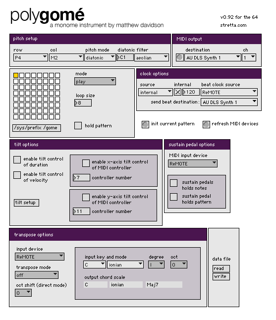

# polygome

by stretta

Polygomé has four modes. Play mode is default. Play mode will begin a pattern on the button you press. A new pattern can be entered if you are in record mode. Up to eight steps can be entered directly on the button surface. Velocity mode enables you to enter a velocity value for each step. The steps are represented as rising bars . Duration/step mode is a bit more complex. The bottom row represents enable/disable states for each step. The seven buttons above each enable/disable toggle operate like the rising velocity bars. The lowest amount = 1 step which is equal to 1 16th note. Higher bars = longer notes for the corresponding step. 

http://vimeo.com/1381241

http://vimeo.com/1968639

The current version of Polygome is now maintained as part of Beap:
http://github.com/stretta/BEAP